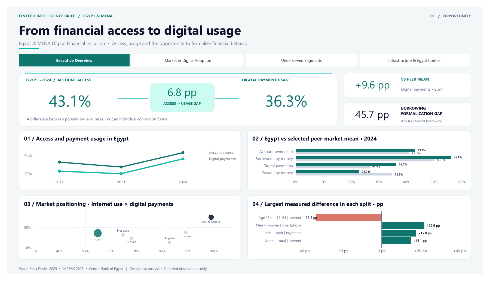
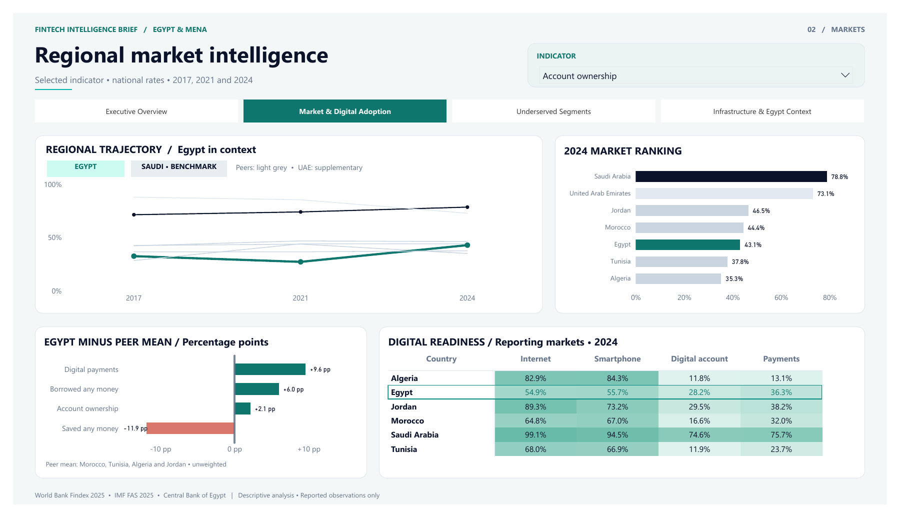
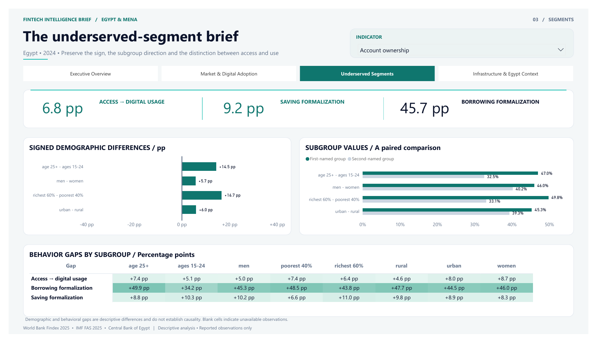
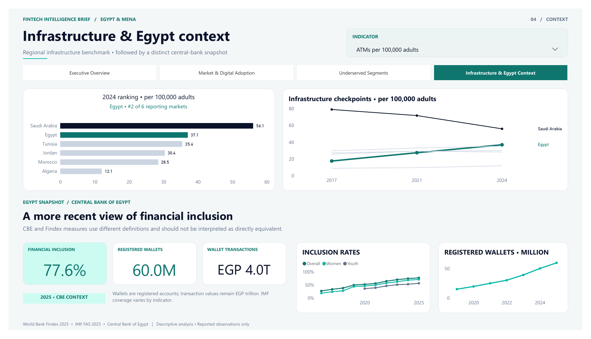

# Egypt & MENA Digital Financial Inclusion Opportunity Analytics

**From Financial Access to Digital Usage: Identifying Underserved Segments and Market Opportunities**

A portfolio business case for a **hypothetical Strategy & Growth team at a regional fintech or digital bank**. Official demand-side, supply-side, and administrative data become a validated SQL-to-Power BI workflow for understanding Egypt's financial inclusion and identifying questions for product and market research.

## Dashboard Preview



[View the four-page PDF](powerbi/Financial_Inclusion_Analytics_Preview.pdf) · [Download the Power BI report](powerbi/Financial_Inclusion_Analytics.pbix)

## Business Problem

Account ownership alone does not explain digital financial usage. The analysis examines Egypt's development, regional position, demographic differences, and saving and borrowing formalization, alongside digital readiness and financial infrastructure. These patterns help prioritize further investigation; they do not establish product demand or causality.

## Key Questions

- How has inclusion evolved in Egypt, and does account access translate into digital usage?
- How does Egypt compare with selected MENA peers?
- Which demographic pairs show the largest measured differences?
- How large are saving and borrowing formalization gaps?
- How does digital readiness compare with financial usage?
- What do infrastructure indicators and recent CBE data add?

## Key Findings

| Evidence | Business interpretation |
|---|---|
| Egypt's 2024 account ownership is **43.1%**, versus **36.3%** digital-payment usage. | The **6.8 percentage-point** difference warrants investigation of usage barriers; it is not a customer conversion rate. |
| Digital-payment usage is **9.6 pp above** the selected peer mean. | Egypt outperforms the unweighted mean of Morocco, Tunisia, Algeria, and Jordan on this measure. |
| Saving and borrowing formalization gaps are **9.2 pp** and **45.7 pp**. | Any-versus-formal activity differs substantially, especially for borrowing; the gaps are population-level comparisons, not addressable-market estimates. |
| CBE reports **77.6%** financial inclusion, **60.0 million** registered mobile wallets, and **EGP 4.0 trillion** in wallet transactions for 2025. | Recent administrative evidence adds Egypt-specific context. Registered wallets are neither unique people nor necessarily active users. |

**CBE's 77.6% and Findex's 43.1% are not directly equivalent.** CBE uses an active transactional-account definition with broader administrative coverage across banks, Egypt Post, mobile wallets, and prepaid cards. Findex is survey-based. The two rates are not a continuous series or a direct measure of growth between 2024 and 2025.

## Data Sources

| Source | Role |
|---|---|
| World Bank Global Findex 2025 | Consumer access, financial behavior, demographics, and digital readiness; primary dashboard comparisons use 2017, 2021, and 2024. |
| IMF Financial Access Survey | Supply-side infrastructure; reporting-country comparisons and historical checkpoints. |
| Central Bank of Egypt, December 2025 reports | Separate inclusion, wallet-registration, and transaction-value context. |

Raw downloads are **not bundled**. [Source filenames, retrieval instructions, and exclusions](data/raw/README.md) support reconstruction. Processed data and SQL-derived exports are included.

## Analytical Pipeline

```text
Official data sources
        ↓
Python / Jupyter
        ↓
Clean processed datasets
        ↓
SQLite database
        ↓
SQL validation & analysis
        ↓
SQL analytical views
        ↓
Power BI-ready exports
        ↓
Power BI dashboard → business insights
```

SQL is the analytical layer that produces all eight dashboard input CSVs. Notebook 05 checks their equivalence to the approved SQL analyses.

## Tools & Skills

**Python · Pandas · Jupyter Notebook · SQL · SQLite · Power BI · DAX · Power Query**

Data cleaning, validation, transformation, modeling, visualization, and business analysis.

## Data Preparation

Country filtering, indicator selection, and long-format restructuring preserve source codes and demographic dimensions. Missing observations are excluded without imputation. IMF coverage is assessed before selecting normalized infrastructure measures; original units remain intact. CBE chart labels are transcribed with source-page references and separate definitions. See [methodology](docs/methodology.md) and [data dictionary](docs/data_dictionary.md).

## SQL Analysis

The [seven SQL scripts](sql/) cover validation, national trends, peer means, signed demographic gaps, gap-magnitude ranking, behavioral gaps, digital readiness, infrastructure rankings, historical checkpoints, and CBE trends. Script 07 defines the eight Power BI views. **NULL observations remain unavailable rather than being converted to zero.**

## Power BI Dashboard

The **Fintech Intelligence Brief** uses Egypt = teal, Saudi Arabia = benchmark navy, and peers = neutral grey. Within paired subgroup charts, teal and grey identify the first- and second-named groups.

- **Executive Overview:** access, usage, peer position, and major gaps.
- **Market & Digital Adoption:** regional trends, rankings, and digital readiness.
- **Underserved Segments:** signed comparisons and subgroup formalization gaps.
- **Infrastructure & Egypt Context:** IMF supply-side measures and separate CBE trends.

<details>
<summary>Explore the other three dashboard pages</summary>







</details>

## Repository Structure

```text
├── README.md, .gitignore, requirements.txt
├── data/
│   ├── raw/README.md          # Source retrieval; downloads excluded
│   └── processed/            # Four CSVs and the validated SQLite database
├── notebooks/               # Five numbered preparation/export notebooks
├── sql/                     # Seven numbered validation/analysis/view scripts
├── powerbi/
│   ├── Financial_Inclusion_Analytics.pbix
│   ├── Financial_Inclusion_Analytics_Preview.pdf
│   ├── data/                # Eight SQL-derived CSVs
│   └── preview/             # Four final dashboard page images
└── docs/
    ├── methodology.md
    └── data_dictionary.md
```

## Methodology & Important Definitions

Egypt is the focal market; four selected peers form an **unweighted reporting-country mean**. Saudi Arabia is an advanced benchmark; UAE is supplementary because coverage varies. Rates are stored as proportions, while differences are percentage points. Subgroup gaps retain their direction. Historical changes compare observed checkpoints, not necessarily consecutive years. [Full definitions](docs/methodology.md).

## How to Reproduce

1. Obtain the official source files listed in [data/raw/README.md](data/raw/README.md).
2. Create a Python environment and run `python -m pip install -r requirements.txt` from the repository root. Start `jupyter notebook` and open the notebooks in `notebooks/`; their working directory must be `notebooks/`.
3. Run notebooks **01–03** in order to prepare the source tables.
4. Run **04** to rebuild SQLite. Execute SQL files **01–06** against `data/processed/financial_inclusion.db` using a SQLite client, inspecting each result set.
5. Run **05** to create the views from script 07, validate SQL equivalence, and export all eight Power BI CSVs.
6. Open the final PBIX in Power BI Desktop. Its imported snapshot is viewable immediately. When opening the PBIX on another computer, set the Power Query `DataFolder` parameter to the local repository's `powerbi/data` directory before refreshing. In **Transform data → Manage Parameters**, replace the generic default `C:\financial-inclusion-analytics\powerbi\data` with your local directory, for example `C:\Users\<user>\Documents\financial-inclusion-analytics\powerbi\data`. All eight CSV queries use this parameter. Preserve transformations and calculations.

To start from the included processed snapshot, skip notebooks 01–03. Rerunning the pipeline overwrites generated data; use a separate checkout if retaining the supplied snapshot. [Reproduction details and checks](docs/methodology.md#reproducibility-and-validation).

## Limitations

Descriptive comparisons do not establish causality or statistical significance. Coverage varies by country, year, indicator, and subgroup. Account counts can exceed people, registration is not activity, and source definitions differ. Future source revisions may change regenerated results; the included processed data fixes the portfolio's validated snapshot.
